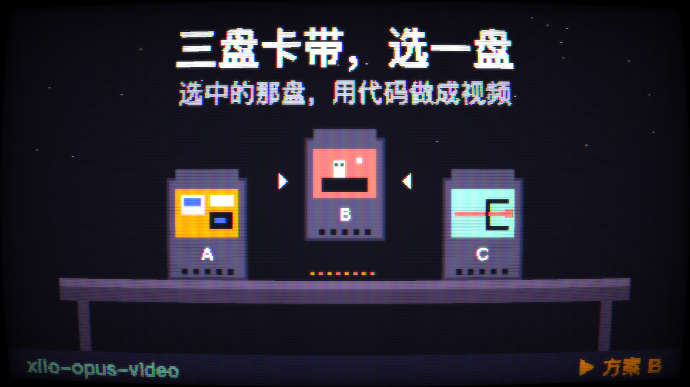
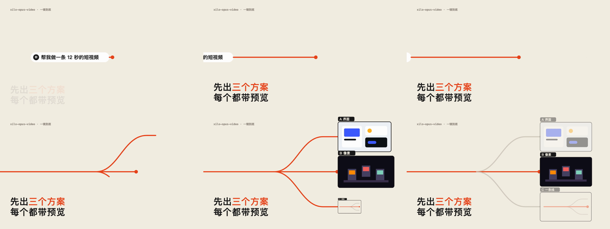

# xilo-opus-video

> 用 Claude Opus 5.5 写代码做视频：先给你三个方案和预览，你挑一个，它再把视频做出来。
>
> Canvas / HTML·CSS·SVG / WebGL 着色器 / Three.js / Remotion / HyperFrames / Manim ｜ 代码合成配乐 ｜ Claude Code Skill

---

## 这个仓库是什么

Opus 5.5 自己不会生成视频。推特上那些刷屏的像素动画、界面动效、游戏史短片，其实是它写了一个会自己动的网页，再一帧一帧截图拍成的视频。

直接丢一句话过去让它做，效果好不好基本靠运气：它怎么规划的你不知道，这次做得好，下次换个主题就不一定了。

xilo-opus-video 把这件事拆成了能确认、能复用的几步：

1. **先问你要做什么**：一个想法、一篇文章、一个产品网址、一个代码库，或者一条参考视频都可以
2. **给三个方案**：风格、技术组合、逐镜头的画面概括、声音、预计渲染时间，三个方案刻意拉开差别
3. **每个方案出预览**：一张关键帧，或者一段 2–4 秒的小样
4. **你确认以后再做**：先把确认的方案写成 `brief.md`（一份结构化提示词，可以复用），再按它逐个镜头制作、逐个镜头出静帧自检，最后渲染成 MP4

---

## 示例：同一个需求，三个方案的预览

需求是「做一条 12 秒的短视频，介绍 xilo-opus-video 这个 Skill，16:9，不配音，配乐用代码合成，风格你来定」。skill 给出的三个方案预览如下，每张都是代码渲染出来的。

**方案 A · 界面动效**（HTML/CSS/SVG + 弹簧动画）


**方案 B · 像素卡带**（Canvas 2D 像素画面 → WebGL CRT 着色器）



**方案 C · 一条线**（SVG 描线 + 一镜到底的跟随镜头，3 秒小样抽帧）



---

## 适合做什么

- 产品宣传片、功能演示、发布会风格的动效短片
- 知识讲解、历史回顾、数据故事
- 像素风、复古电视、手绘、界面动效这类风格化短片
- 照着一条参考视频的结构和手法，做一条自己的
- 已经有视频模型生成的**绿幕人物**，想用代码给它搭场景、加大字和动效

不适合：

- 直接生成写实画面（这需要视频模型，本 skill 只负责代码这一层）
- 在剪映、Premiere、AE 里剪辑现成素材
- 给已有视频加字幕

---

## 安装

在 Claude Code 里直接说：

```text
帮我安装这个 Skill：https://github.com/Kianzzz/xilo-opus-video
```

或者用 skills 命令行：

```bash
npx skills add Kianzzz/xilo-opus-video
```

或者手动复制：

```bash
git clone https://github.com/Kianzzz/xilo-opus-video.git
cp -r xilo-opus-video/skills/xilo-opus-video ~/.claude/skills/
```

### 需要的环境

- Python 3.9+，以及 `numpy`、`playwright`（`python3 -m pip install numpy playwright`）
- FFmpeg
- 一个 Chromium 内核的浏览器：`python3 -m playwright install chromium`，或者装了 Google Chrome 也可以

第一次使用时 skill 会运行 `scripts/check_env.py` 检查一遍，缺什么会告诉你怎么装。

---

## 怎么用

装好以后，直接跟 Claude 说你想做什么：

```text
帮我做一条 30 秒的产品宣传片，产品是 https://example.com，16:9，配乐用代码合成
```

```text
这是我的一篇文章（附上文字），帮我做成一条 60 秒的竖屏知识讲解视频
```

```text
参考这条视频的节奏和转场，做一条介绍我们 App 新功能的 15 秒视频（附上视频文件）
```

所有产出放在当前目录的 `opus-video/<项目名>/` 下：

```
source/      原材料、参考视频抽帧和分析
previews/    三个方案的预览
brief.md     确认后的完整方案（结构化提示词，可以复用）
index.html   成片的画面代码
audio/       合成的配乐和音效
qa/          自检用的静帧和抽帧图
out/         成片 MP4
```

---

## 里面有什么

```
skills/xilo-opus-video/
  SKILL.md                    流程：问需求 → 三个方案 → 预览 → 确认 → brief → 制作 → 验收
  references/
    code-stack.md             八种代码各自擅长什么，风格和技术组合怎么对应
    plan-format.md            三个方案的写法和预览规则
    brief-template.md         七块结构的提示词模板
    craft-rules.md            画面只由时间决定、弹簧和节拍、声音、验收清单
  scripts/
    check_env.py              检查 Python / FFmpeg / Playwright / 浏览器 / WebGL
    render.py                 逐帧渲染：单帧预览、整片、只渲一段、运动模糊、混音
    analyze_video.py          视频信息、镜头切换时间点、抽帧拼图（参考视频分析和成片验收都用它）
    audio_tools.py            按时间表合成音效、响度标准化、波形和频谱图
```

---

## 致谢

这套做法是拆了一批公开案例、再复刻验证以后整理出来的，感谢这些把作品和做法公开出来的作者：

- [@twoclipping](https://x.com/twoclipping) 开源的界面动效提示词模板（seek(t)、闭式弹簧、节拍网格、子帧运动模糊）
- [@kimmonismus](https://x.com/kimmonismus) 公开的 AI 发展史提示词（先写分镜、每个场景出静帧自检）
- [@majidmanzarpour](https://x.com/majidmanzarpour) 公开的像素巫师提示词
- [@prasenx](https://x.com/prasenx)、[@aiwarts](https://x.com/aiwarts)、[@Gorden_Sun](https://x.com/Gorden_Sun)、[@AbaneChan](https://x.com/AbaneChan) 公开的作品和做法

## License

MIT
